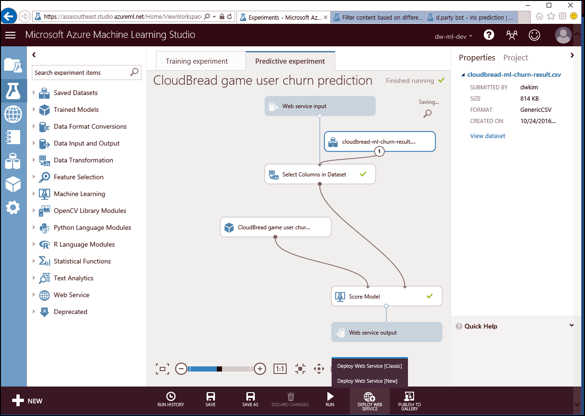
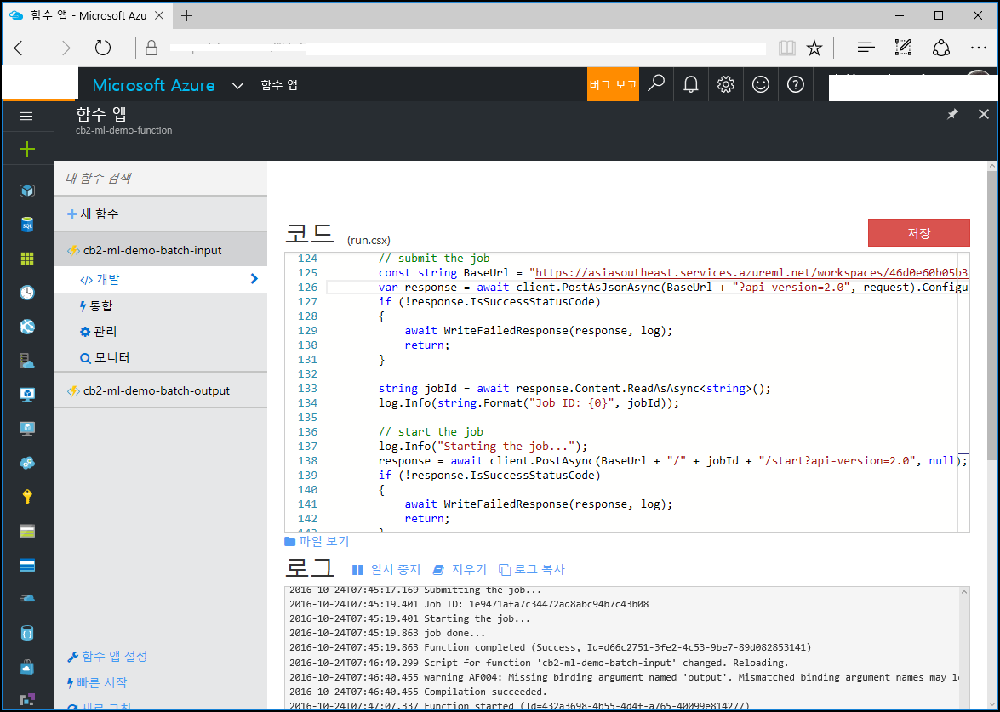
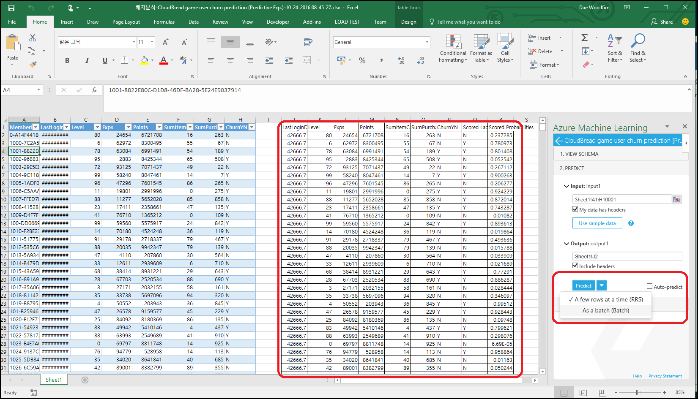

# kaist-cs492
Presentation document for kaist CS492 class - 20161103
Session subject :Machine Learning developer in "Business"  
Short URL : https://aka.ms/cs492  
Github repo : https://github.com/CloudBreadPaPa/kaist-cs492  
Download PDF in docs folder  
slideshare link : TBD  

Agenda
- People using ML in business (10 min)
- Machine Learning subsets including Deep Learning Toolkit CNTK and Tensorflow (20 min)
- Building predictive model & deploy in Azure Machine Learning (20 min)
- Q&A (10 min)

###Machine Learning demo
Implement whole workflow - Machine Learning algorithm for predictive analytics 

[Game user churn prediction real-time prediction & Batch prediction](https://gallery.cortanaintelligence.com/Experiment/CloudBread-game-user-churn-prediction-1)  

  

[In-game item suggestion real-time prediction & Batch prediction](https://gallery.cortanaintelligence.com/Experiment/CloudBread-game-item-suggestion-prediction-1)  

###Objective :  
Predict real-time and batch task with shared Machine Learning model  

- Create Machine Learning model or copy gallery model  

-   

- Execute training and check the result  

-   

- Produce Predictive model and publish as "API Web Service"

-   

- Generate service API Key and execute real-time predict with code

    ```
    public class UserChurnController : ApiController  
    {
        // POST api/UserChurn
        public HttpResponseMessage POST(CBChurn p)
        {
            // Machine Learning function request
            InvokeRequestResponseService(p).Wait();
            ...
        }

        // Call Machine Learning Web Service
        static async Task InvokeRequestResponseService(CBChurn p)
        {
            ...
            const string apiKey = "Change-API-Key"; // Replace this with the API key for the web service
            client.DefaultRequestHeaders.Authorization = new AuthenticationHeaderValue("Bearer", apiKey);
            client.BaseAddress = new Uri("Change-Machine-Learning-Web-Service-URL");
            HttpResponseMessage response = await client.PostAsJsonAsync("", scoreRequest).ConfigureAwait(false);
            if (response.IsSuccessStatusCode)
            {
                string result = await response.Content.ReadAsStringAsync();
                Debug.WriteLine("Result: {0}", result);
                p.ChurnYN = result;
            }
            ...
        }
    }
    ```

-   

- Publish Machine Learning API Controller, test in Postman of real-time prediction  

- To execute Batch processing, use Machine Learning Batch execution code  

-   

- In addition, use Azure Functions for server-less batch execution  

-   

Please, reference Postman collection and CloudBread-Machine-Learning source code  
